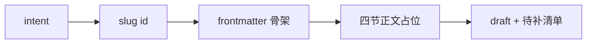
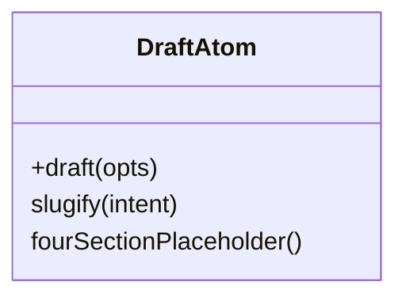
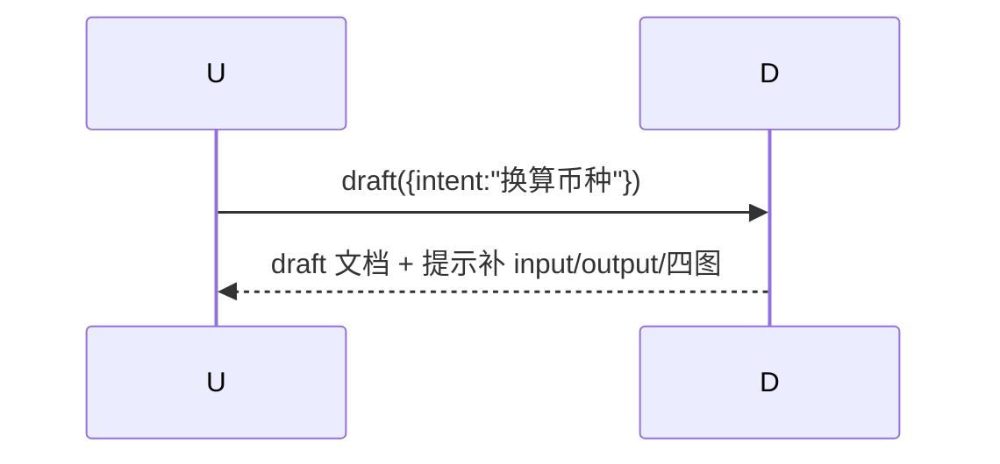
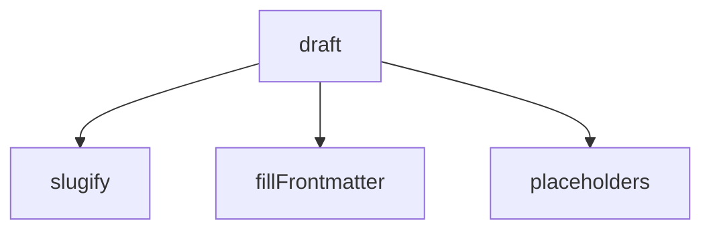

## 它做什么

由一句意图生成 atom 文档骨架（含空四节正文占位）。确定性实现：不调用 LLM、可重复可测试。

## 怎么实现

**1) 数据流转（flowchart）**

**2) 模块分解（classDiagram）**

**3) 交互时序（sequenceDiagram）**

**4) 调用图（graph）**

## 何时用

- 适用：投稿快速起稿，再用 atom.gate.validate 自检。
- 不适用：成品需人工补正文四图与测试。

## 示例

输入 { intent:"把金额换算成目标币种" } → 输出 id:"contrib.amount_convert" 骨架 + 补齐清单。
