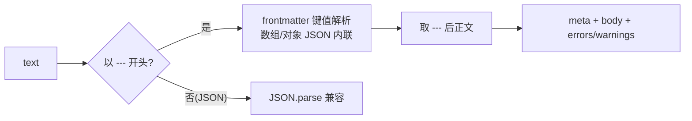
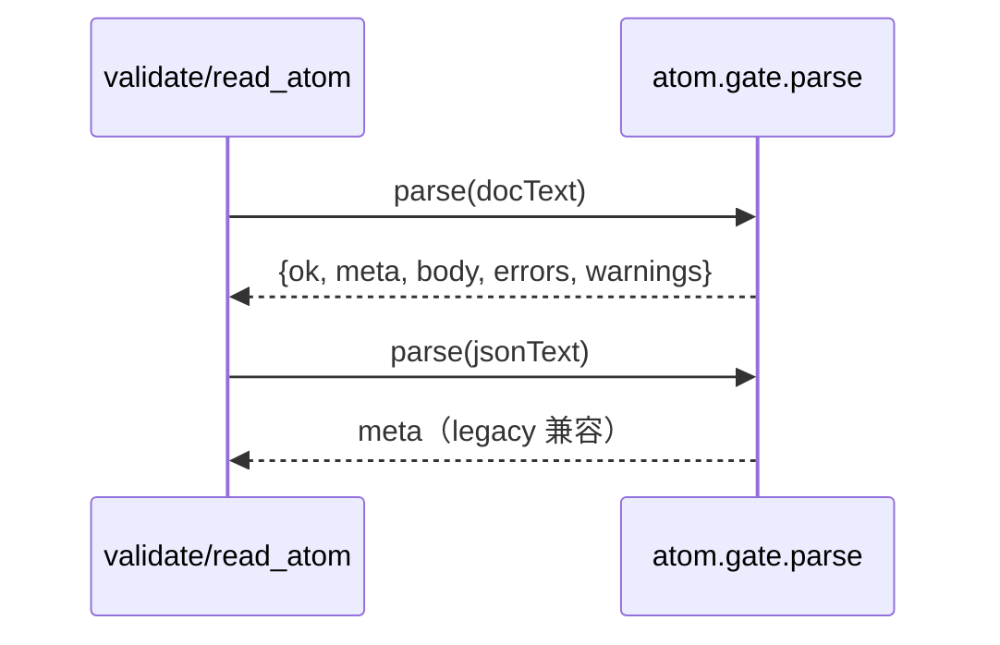
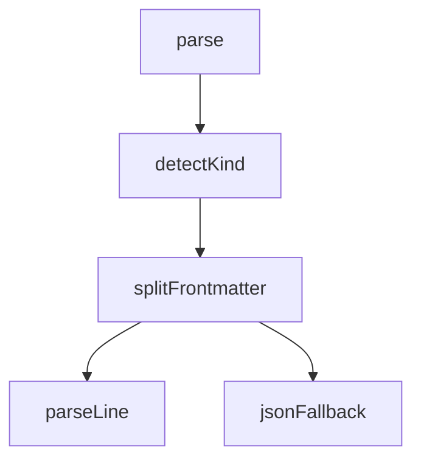

## 它做什么

把一份原子文档解析成两段：frontmatter（YAML 键值 = manifest 字段，`description` 除外）与 frontmatter 之后的 Markdown 正文（= description）。v0.2 的 JSON manifest 也被兼容处理。确定性纯函数，不调 LLM、不联网。

## 怎么实现

**1) 数据流转（flowchart：一份输入怎么变成 meta+body）**


**2) 模块分解（classDiagram：代码/类怎么划分与归属）**
```mermaid
classDiagram
class DocParser { +parse(text): {meta, body, errors} }
DocParser : frontmatter 行解析 key: value
DocParser : JSON 内联值 / 标量 / 引号
DocParser : 未闭合 frontmatter 报错
```

**3) 交互时序（sequenceDiagram：调用方与本原子怎么协作）**


**4) 调用图（graph：本原子及内部调用关系）**


## 何时用

- 适用：atom_read 回源读文档后先解析；validate/目录生成/联邦发现的预处理。
- 不适用：不做语义校验（那是 atom.gate.validate）；不改写正文内容。

## 示例

输入 { text: "---\nid: a.b\nintent: 做X\n---\n\n## 它做什么\n…" } → 输出 { ok: true, meta: { id: "a.b", intent: "做X" }, body: "## 它做什么\n…" }。
