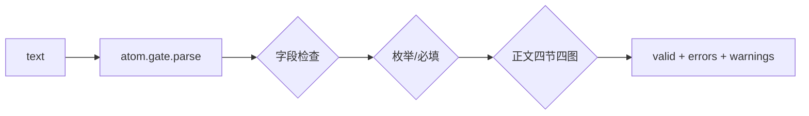
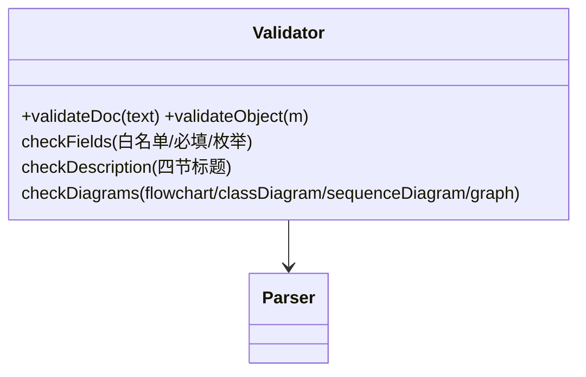
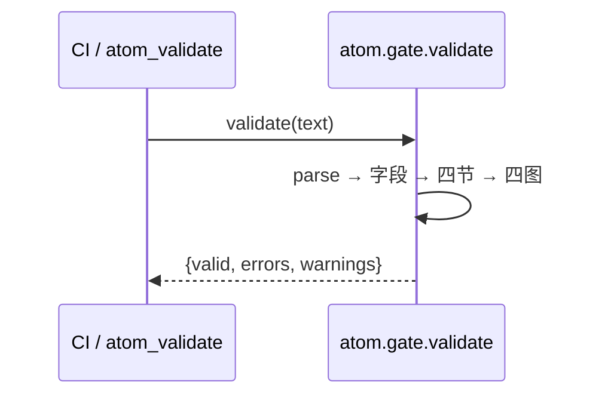
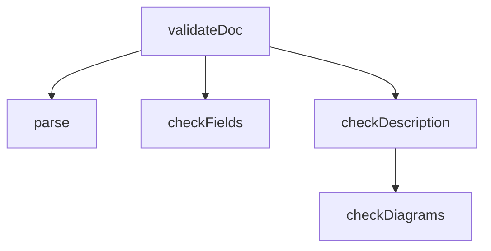

## 它做什么

机器闸：对一个原子做**结构硬检**——顶层字段 ⊆ 白名单、`id/layer/version/intent/input/output` 必填、枚举合法；正文本体必须含四个 `##` 小节与四张 Mermaid 图（flowchart/classDiagram/sequenceDiagram/graph）。校验过 = 收录，无人工评审。确定性纯函数，不联网。

## 怎么实现

**1) 数据流转（flowchart：从文档到 valid/errors）**

**2) 模块分解（classDiagram：检查职责划分）**

**3) 交互时序（sequenceDiagram：调用方与本原子怎么协作）**

**4) 调用图（graph：检查内部关系）**

## 何时用

- 适用：投稿自检、软件原子市场 PR CI、dsh-atom-market 的 atom_validate、联邦发现器的逐文件闸门。
- 不适用：不判断图与实现的"真实性"（由作者署名负责，使用反馈淘汰）。

## 示例

输入 { text: "<atom.md 全文>" } → 输出 { valid: true, errors: [], warnings: [] }；缺 `## 示例` 时 → { valid: false, errors: ["缺少章节 示例"] }。
