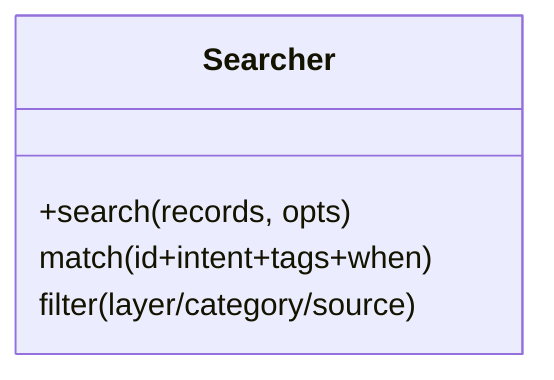
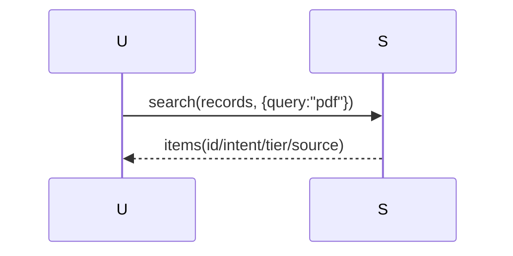
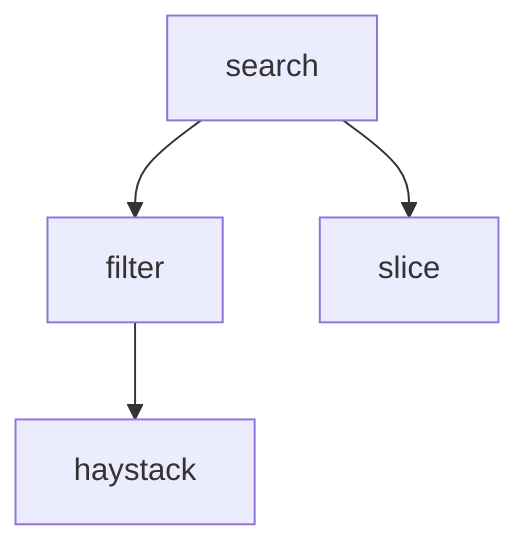

## 它做什么

在原子指针集里按 query 检索 id+intent+tags+when_to_use（可过滤 layer/category/source）。确定性实现：不调用 LLM、可重复可测试。

## 怎么实现

**1) 数据流转（flowchart）**
```mermaid
flowchart LR
R[records] --> Q[query/layer/category/source 过滤]
Q --> S[排序 id]
S --> OUT[items[]]
```

**2) 模块分解（classDiagram）**


**3) 交互时序（sequenceDiagram）**


**4) 调用图（graph）**


## 何时用

- 适用：atom_search 返回指针级一句话命中。
- 不适用：不做语义/向量检索，不含详情。

## 示例

输入 { query:"PDF 抽表", limit:5 } → { items:[{id:"pdf.extract_tables", intent:"从 PDF 中抽出所有表格", tier:"verified", source:"…"}] }。
