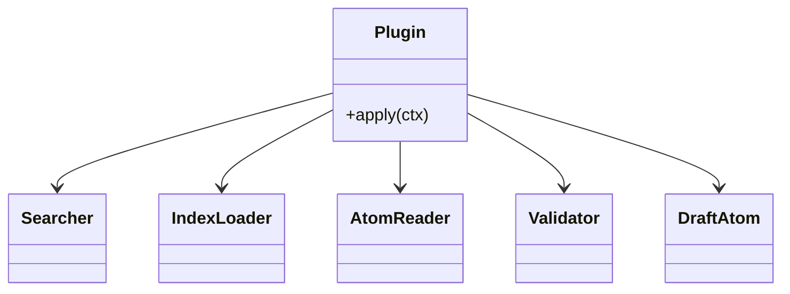
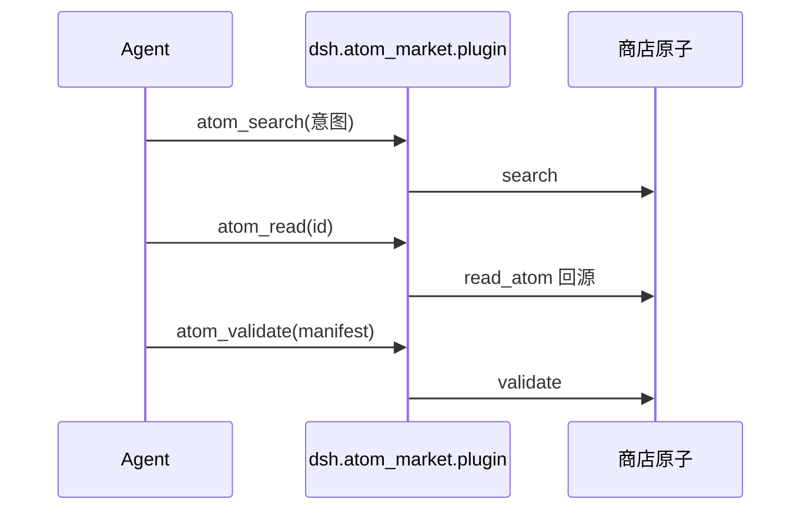
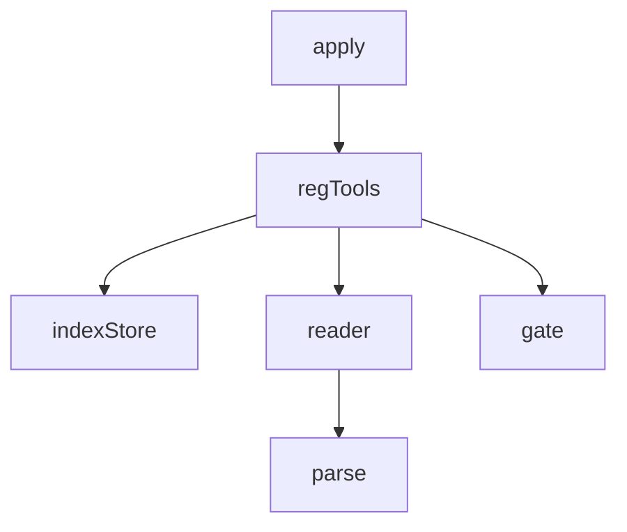

## 它做什么

把逛/读/验/稿四个商店动作注册进 DSH：分装成可对话的商店插件（框架原子）。确定性编排：不调 LLM、可重复可测试。

## 怎么实现

**1) 数据流转（flowchart）**
```mermaid
flowchart LR
CTX[ctx(tools)] --> R[注册 atom_search]
CTX --> R2[注册 atom_read]
CTX --> R3[注册 atom_validate]
CTX --> R4[注册 atom_draft]
R --> SE[registry.search]
R2 --> RA[store.read_atom]
R3 --> VA[atom.gate.validate]
R4 --> DR[atom.draft]
```

**2) 模块分解（classDiagram）**


**3) 交互时序（sequenceDiagram）**


**4) 调用图（graph）**


## 何时用

- 适用：把软件原子市场装进 dsh，Agent 可逛/读/验/稿。
- 不适用：不是原子库本身（原子由商店收录）。

## 示例

在 dsh 内 `dsh plugin add github:ZiFan1117/dsh-atom-market` → 会话可直接用 atom_search/atom_read/atom_validate/atom_draft。
