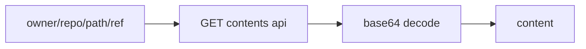
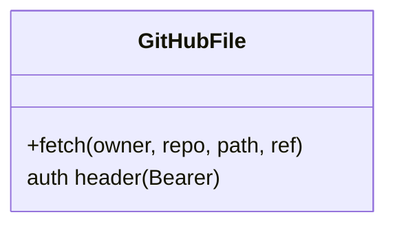
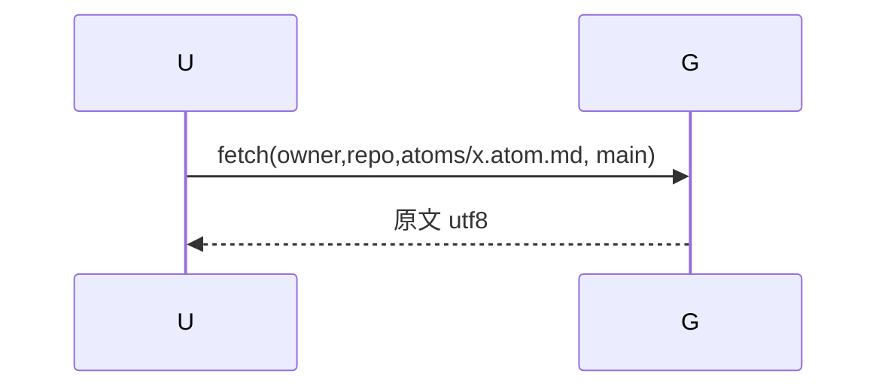
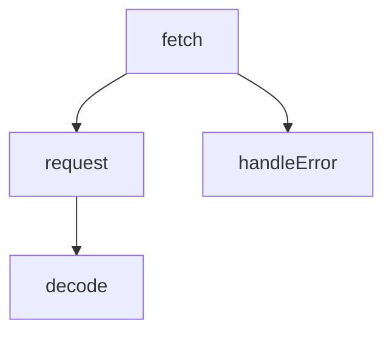

## 它做什么

从 GitHub contents API 读取仓库某文件原文（base64 解码为 UTF-8）。确定性实现：不调用 LLM、可重复可测试。

## 怎么实现

**1) 数据流转（flowchart）**

**2) 模块分解（classDiagram）**

**3) 交互时序（sequenceDiagram）**

**4) 调用图（graph）**

## 何时用

- 适用：回源读 manifest/atom 文档、registry 索引。
- 不适用：写/改文件（只读）。

## 示例

输入 { owner:"ZiFan1117", repo:"software-atom-market", path:"registry/index.json", ref:"main" } → { ok:true, content:"{…}" }。
