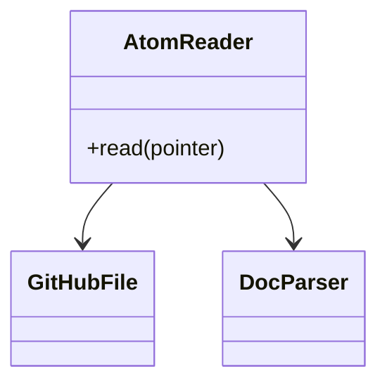
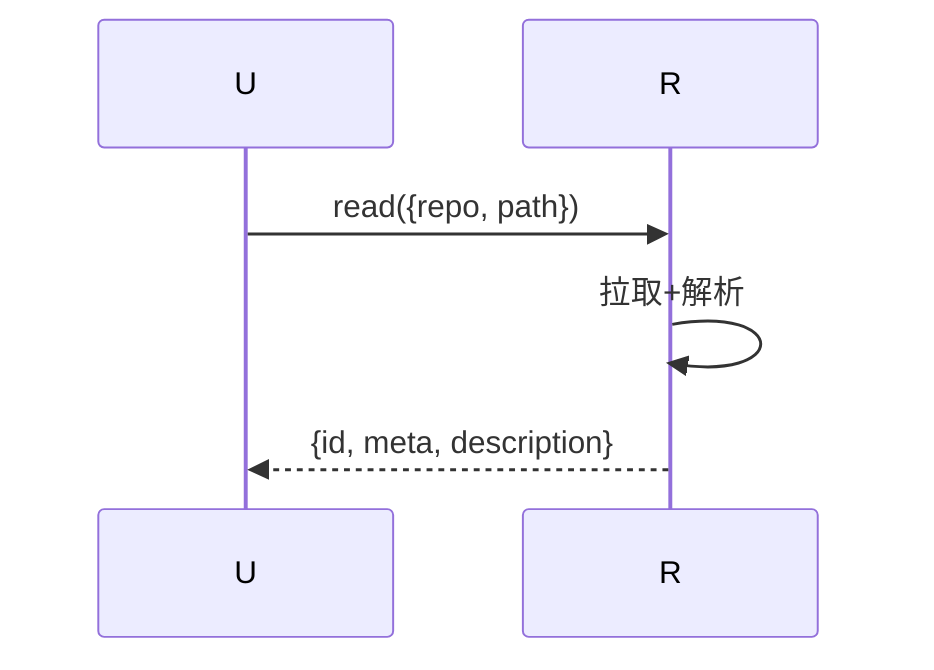
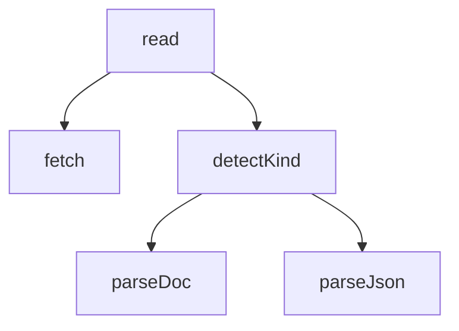

## 它做什么

按指针回源读 manifest/atom 文档并解析（.atom.md 与旧 .atom.json 均支持）。确定性实现：不调用 LLM、可重复可测试。

## 怎么实现

**1) 数据流转（flowchart）**
```mermaid
flowchart LR
P[repo+path] --> F[github.fetch_file]
F --> KIND{.atom.md?}
KIND -- 是 --> PR[atom.gate.parse → meta+body]
KIND -- 否(JSON) --> JP[JSON.parse manifest]
PR --> OUT[meta + description(body)]
JP --> OUT
```

**2) 模块分解（classDiagram）**


**3) 交互时序（sequenceDiagram）**


**4) 调用图（graph）**


## 何时用

- 适用：atom_read 命中后给完整详情。
- 不适用：不做索引检索（那是 store.read_index/atom.registry.search）。

## 示例

输入 { repo:"ZiFan1117/bazidiy", path:"atoms/bazidiy.propose_designs.atom.md" } → { ok:true, id:"…", meta:{…}, description:"## 它做什么…" }。
