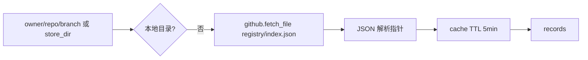
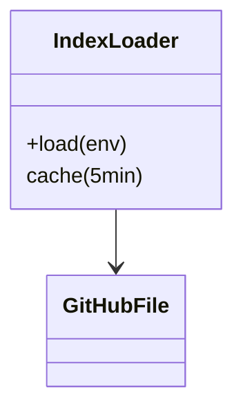
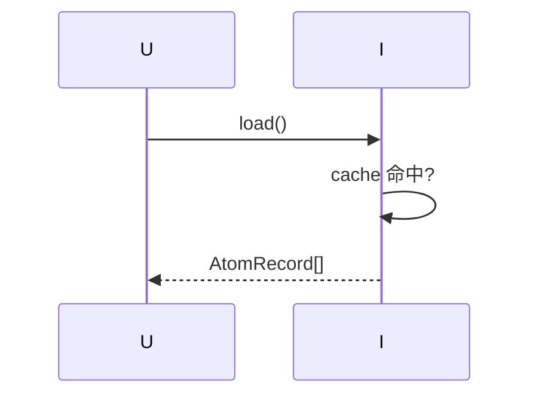
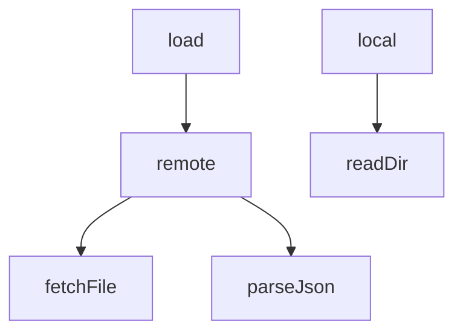

## 它做什么

拉取并缓存 registry/index.json 指针集（或本地 DSH_ATOM_STORE_DIR atoms 目录）。确定性实现：不调用 LLM、可重复可测试。

## 怎么实现

**1) 数据流转（flowchart）**

**2) 模块分解（classDiagram）**

**3) 交互时序（sequenceDiagram）**

**4) 调用图（graph）**

## 何时用

- 适用：atom_search/atom_read 先取商店指针集。
- 不适用：不回源拉详情（那是 store.read_atom）。

## 示例

输入 {}（默认 ZiFan1117/software-atom-market@main）→ { ok:true, records:[{id,intent,layer,…}×N] }。
