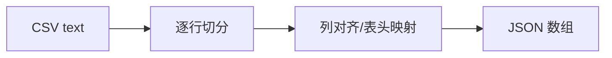
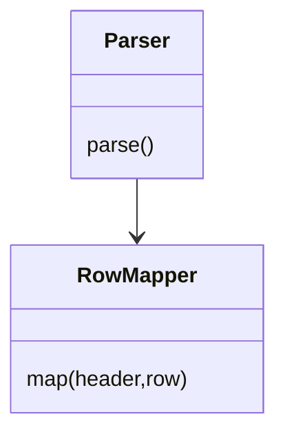
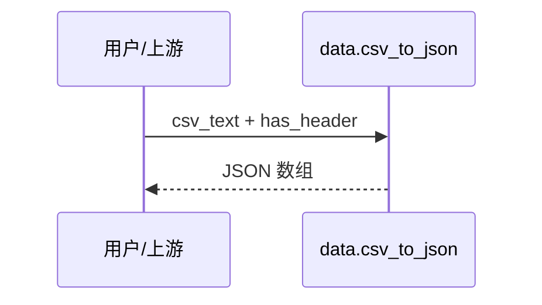
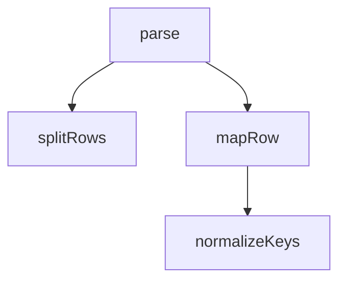

## 它做什么

把 CSV 原始文本按分隔符解析，转成 JSON 对象数组：有表头则以表头为键，无表头则输出 col_0, col_1 键。

## 怎么实现

数据流转：

模块分解：

交互时序：

调用图：

## 何时用 / 何时不用

- 适用：文本层完整的 CSV（含/不含表头、自定义分隔符）。
- 不适用：超大文件请先切片；单元格内嵌分隔符需先选不冲突的 delimiter。

## 示例

输入：`name,age\nalice,30\nbob,25` → 输出：`[{name:alice,age:30},{name:bob,age:25}]`
