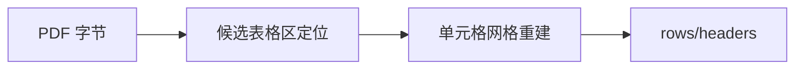
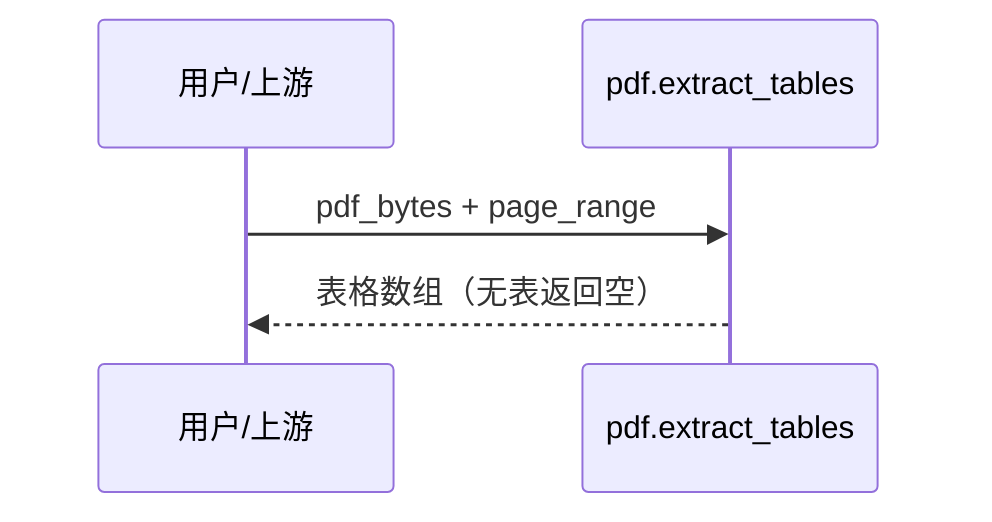
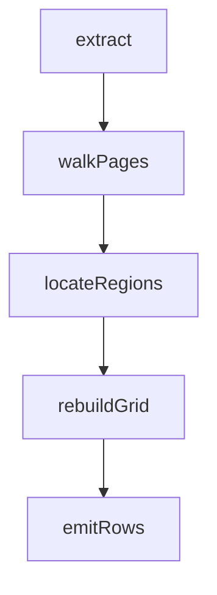

## 它做什么

把 PDF 中版式规整的表格识别出来，输出为「表头 + 行」的结构化 JSON 数组；下游原子（换算/汇总/入库）可直接消费。

## 怎么实现

数据流转：


模块分解：
```mermaid
classDiagram
  class Locator { locate(page) }
  class GridBuilder { rebuild(region) }
  class Normalizer { flatten(cell) }
  Locator --> GridBuilder --> Normalizer
```

交互时序：


调用图：


## 何时用 / 何时不用

- 适用：报表、账单、论文数据表等文本层完整的版式化表格。
- 不适用：扫描件/纯图片表格（无文本层，需先接 OCR 原子）；版式极乱的发票（结果需人工抽检）。

## 示例

输入：单页含一张两列表格的 PDF（表头 name,age）→ 输出：`[{headers:[name,age],rows:[[alice,30],[bob,25]],page:1}]`
